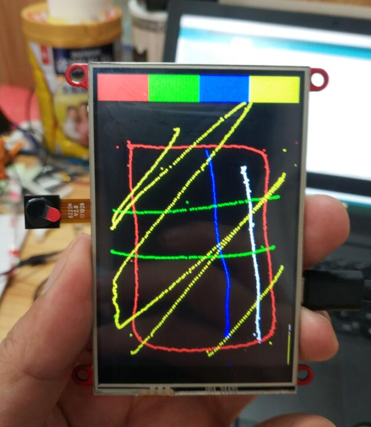

# Touch Screen Camera

```c++
/*
Version:		V1.0
Author:			Vincent
Create Date:	2020/8/19
Note:
	
*/
```


[toc]

# OVERVIEW

## Introduce

[Makerfabs home page](https://www.makerfabs.com/)

[Makerfabs Wiki](https://makerfabs.com/wiki/index.php?title=Main_Page)

The realization of a simple digital camera, you can take pictures through the camera, framing.It is displayed on the TFT screen and provides touch options.Photos taken can be saved on an SD card.

## Equipment list

- ESP32 Touch Camera
- Micro SD card


# ESP32 Touch Camera

## ~~Product link ：~~[ ~~ESP32 Touch Camera~~]() 

The ESP32 Touch Camera USES the ILI9488 screen, which comes with resistive and capacitive screens.And an OV2640 camera and SD card slot.It can be used as a webcam, an electronic album, or a digital camera.Support for Arduino and MicroPython.This project

## Feature

- Integrated ESP32 2.4G WiFi and Bluetooth.
- Micro SD card slot on board.
- Input 5.0V Type-C USB .
- OV2640 is a 1/4 inch CMOS UXGA (1632*1232) image sensor manufactured by OmniVision.
- LCD 3.5 inch Amorphous-TFT-LCD (Thin Film Transistor Liquid Crystal Display) for mobile-phone or handy electrical equipments.
- NS2009 is A 4-wire resistive touch screen control circuit with I2C interface, which contains A 12-bit resolution A/D converter.

- The FT6X36 Series ICs are single-chip capacitive touch panel controller IC with a built-in 16 bit enhanced Micro-controller unit

(MCU).


# STEPS

## Prepare And Burn

**If you have any questions，such as how to install the development board, how to download the code, how to install the library. Please refer to :[Makerfabs_FAQ](https://github.com/Makerfabs/Makerfabs_FAQ)**

- Install board : esp32 .
- Install library : Adafruit GFX library.
- Modify the code based on the touch screen.Use the resistive screen to remove the NS2009 comment and the capacitive screen to remove the FT6236 comment.
- 
```c++
//#define NS2009_TOUCH
#define FT6236_TOUCH

#ifdef NS2009_TOUCH
#include "NS2009.h"
const int i2c_touch_addr = NS2009_ADDR;
#endif

#ifdef FT6236_TOUCH
#include "FT6236.h"
const int i2c_touch_addr = TOUCH_I2C_ADD;
#endif

```

- Upload file "/Project_Touch-Screen-Camra/Camera/Camera.ino"

- Insert a Micro SD card into ESP32 Touch Camera.


## How to use ESP32 Touch Camera

- Open the serial port monitor after uploading the code.
- Serial port will return initialization information, pay attention to see if there is any error.

```txt
14:48:49.096 -> ets Jun  8 2016 00:22:57
14:48:49.096 -> 
14:48:49.096 -> rst:0x1 (POWERON_RESET),boot:0x17 (SPI_FAST_FLASH_BOOT)
14:48:49.096 -> configsip: 0, SPIWP:0xee
14:48:49.096 -> clk_drv:0x00,q_drv:0x00,d_drv:0x00,cs0_drv:0x00,hd_drv:0x00,wp_drv:0x00
14:48:49.096 -> mode:DIO, clock div:1
14:48:49.096 -> load:0x3fff0018,len:4
14:48:49.096 -> load:0x3fff001c,len:1100
14:48:49.096 -> load:0x40078000,len:9232
14:48:49.096 -> load:0x40080400,len:6400
14:48:49.096 -> entry 0x400806a8
14:48:50.641 -> ILI9488 Test!
14:48:50.641 -> I2C device found at address 0x38  !
14:48:50.675 -> Card Mount Successed
14:48:50.675 -> SD init over.
14:48:51.397 -> TFT init over.
14:49:10.660 -> Image name：/0write.bmp
14:49:13.859 -> Image name：/1write.bmp

```


- If the SD card cannot be mounted on return, you need to re-insert the SD card.
- If everything is normal, the camera interface will be displayed.


- Press the camera button to take photos automatically.
- Click on the previous photo to show the last photo saved on the SD card.


- Pressing to show the last photo will stop the camera acquisition. To restore the preview, press open Stream.
- Restore stream mode to take photos again.
- You can unplug your SD card and plug it into your computer to view your photos.


# Project Description

The Touch Camera contains a lot of parts, including ESP32, the screen, the Touch screen and the Camera.Below is the test code for each component, and the final combination of the digital camera project.

## TFT screen
### ILI9488

ILI9488 doesn't have an official library under Arduino, but it has a modified version based on a third-party driver on Github.Adafruit GFX library can realize the basic functions: draw points, lines, geometric figures, direction adjustment, bitmap display and so on.

- /Project_Touch-Screen-Camra/ILI9488 ：ILI9488 driver.

Library file, cannot be run directly.

- /Project_Touch-Screen-Camra/9488test：ILI9488 screen test, SD card test.

Run various drawing functions and read the SD card list.

- /Project_Touch-Screen-Camra/SD2TFT ：Display pictures from SD card.

Loop back the images in the SD card.


## Touch Screen

### NS2009

NS2009 is an I2C protocol resistance screen drive IC, output X, Y, Z1, Z2 four axis 12 bit data.

### FT6236

FT6236 is a capacitive screen driver IC of I2C protocol, which directly outputs the coordinate value after filtering.

- /Project_Touch-Screen-Camra/touch_screen_driver_example/ft6236 : FT6236 Driver demonstration

- /Project_Touch-Screen-Camra/touch_screen_driver_example/ns2009 ：NS2009 Driver demonstration

- /Project_Touch-Screen-Camra/touch_screen_driver_example/i2c_scanner ：I2C scanner

- /Project_Touch-Screen-Camra/touch_draw ：\- Touch screen drawing test, COMPATIBLE with NS2009 and FT6236

Use your hand or stylus (resistance screen) to draw on the screen.




## Camera

### OV2640

OV2640 is a 1/4 inch CMOS UXGA (1632*1232) image sensor manufactured by OmniVision.Support automatic exposure control, automatic gain control, automatic white balance, automatic elimination of light stripes and other automatic control functions.UXGA can reach up to 15 frames per second, SVGA up to 30 frames, CIF up to 60 frames. Image compression is supported, JPEG image data can be output.

- /Project_Touch-Screen-Camra/CAM2TFT : The camera is displayed to the TFT screen for testing.

Simply display the images captured by the camera on the screen.

- /Project_Touch-Screen-Camra/Camera ：Camera program.

Contains images captured by the live display camera.Save the photo to an SD card.Browse the images saved on the SD card.Touch screen analog button control.


# Code Explain

## ILI9488.h

- Regisiter define.

```c++

#define ILI9488_TFTWIDTH 320
#define ILI9488_TFTHEIGHT 480
...
    
...
#define ILI9488_GMCTRP1 0xE0
#define ILI9488_GMCTRN1 0xE1
```

- Color define(RGB565)

```c++
// Color definitions
#define ILI9488_BLACK 0x0000       /*   0,   0,   0 */
#define ILI9488_NAVY 0x000F        /*   0,   0, 128 */
#define ILI9488_DARKGREEN 0x03E0   /*   0, 128,   0 */
#define ILI9488_DARKCYAN 0x03EF    /*   0, 128, 128 */
#define ILI9488_MAROON 0x7800      /* 128,   0,   0 */
#define ILI9488_PURPLE 0x780F      /* 128,   0, 128 */
#define ILI9488_OLIVE 0x7BE0       /* 128, 128,   0 */
#define ILI9488_LIGHTGREY 0xC618   /* 192, 192, 192 */
#define ILI9488_DARKGREY 0x7BEF    /* 128, 128, 128 */
#define ILI9488_BLUE 0x001F        /*   0,   0, 255 */
#define ILI9488_GREEN 0x07E0       /*   0, 255,   0 */
#define ILI9488_CYAN 0x07FF        /*   0, 255, 255 */
#define ILI9488_RED 0xF800         /* 255,   0,   0 */
#define ILI9488_MAGENTA 0xF81F     /* 255,   0, 255 */
#define ILI9488_YELLOW 0xFFE0      /* 255, 255,   0 */
#define ILI9488_WHITE 0xFFFF       /* 255, 255, 255 */
#define ILI9488_ORANGE 0xFD20      /* 255, 165,   0 */
#define ILI9488_GREENYELLOW 0xAFE5 /* 173, 255,  47 */
#define ILI9488_PINK 0xF81F
```

- Refactor the basic drawing function of the Adafruit GFX library

```c++
void setAddrWindow(uint16_t x0, uint16_t y0, uint16_t x1, uint16_t y1);
void setScrollArea(uint16_t topFixedArea, uint16_t bottomFixedArea);
void scroll(uint16_t pixels);
void pushColor(uint16_t color);
void pushColors(uint16_t *data, uint8_t len, boolean first);
void drawImage(const uint8_t *img, uint16_t x, uint16_t y, uint16_t w, uint16_t h);
void fillScreen(uint16_t color);
void drawPixel(int16_t x, int16_t y, uint16_t color);
void drawFastVLine(int16_t x, int16_t y, int16_t h, uint16_t color);
void drawFastHLine(int16_t x, int16_t y, int16_t w, uint16_t color);
void fillRect(int16_t x, int16_t y, int16_t w, int16_t h, uint16_t color);
void setRotation(uint8_t r);
void invertDisplay(boolean i);
void show_all_define();
uint16_t color565(uint8_t r, uint8_t g, uint8_t b);
```


## ILI9488.cpp

- In other file define SPI_HAS_TRANSACTION and ARDUINO_ARCH_ARC32.You can change SPI speed at this.

```c++
// If the SPI library has transaction support, these functions
// establish settings and protect from interference from other
// libraries.  Otherwise, they simply do nothing.
#ifdef SPI_HAS_TRANSACTION
static inline void spi_begin(void) __attribute__((always_inline));
static inline void spi_begin(void) {
#if defined (ARDUINO_ARCH_ARC32)
  // max speed!
  SPI.beginTransaction(SPISettings(60000000, MSBFIRST, SPI_MODE0));	//Change this !!!
#else
    // max speed!
  SPI.beginTransaction(SPISettings(24000000, MSBFIRST, SPI_MODE0));
#endif
}
static inline void spi_end(void) __attribute__((always_inline));
static inline void spi_end(void) {
  SPI.endTransaction();
}
#else
#define spi_begin()
#define spi_end()
#endif
```


## Camera.ino

- Touch Screen define. Use "#define NS2009_TOUCH" or "#define FT6236_TOUCH".

```c++
//Choice your touch IC
#define ESP32_SDA 26
#define ESP32_SCL 27

//#define NS2009_TOUCH
#define FT6236_TOUCH

#ifdef NS2009_TOUCH
#include "NS2009.h"
const int i2c_touch_addr = NS2009_ADDR;
#endif

#ifdef FT6236_TOUCH
#include "FT6236.h"
const int i2c_touch_addr = TOUCH_I2C_ADD;
#endif
```

- Init Touch Screen(I2C), SD card(SPI),ILI9488(SPI).

```c++
void esp32_init()
{
    Serial.begin(115200);
    Serial.println("ILI9488 Test!");

    //I2C init
    Wire.begin(ESP32_SDA, ESP32_SCL);
    byte error, address;

    Wire.beginTransmission(i2c_touch_addr);
    error = Wire.endTransmission();

    if (error == 0)
    {
        Serial.print("I2C device found at address 0x");
        Serial.print(i2c_touch_addr, HEX);
        Serial.println("  !");
    }
    else if (error == 4)
    {
        Serial.print("Unknown error at address 0x");
        Serial.println(i2c_touch_addr, HEX);
    }

    //SPI init
    pinMode(SD_CS, OUTPUT);
    pinMode(TFT_CS, OUTPUT);
    SPI_OFF_SD;
    SPI_OFF_TFT;

    SPI.begin(SPI_SCK, SPI_MISO, SPI_MOSI);

    //SD(SPI) init
    SPI_ON_SD;
    if (!SD.begin(SD_CS, SPI, 80000000))
    {
        Serial.println("Card Mount Failed");
        while (1)
            ;
    }
    else
    {
        Serial.println("Card Mount Successed");
    }
    //sd_test();
    SPI_OFF_SD;

    Serial.println("SD init over.");

    //TFT(SPI) init
    SPI_ON_TFT;
    tft.begin();
    tft.setRotation(0);
    tft.fillScreen(ILI9488_BLACK);
    draw_button();
    SPI_OFF_TFT;
    Serial.println("TFT init over.");
}
```

- Init OV2640. Set frame 320 * 240,  format RGB565.

```c++
void camera_init()
{
    //camera config
    camera_config_t config;
    config.ledc_channel = LEDC_CHANNEL_0;
    config.ledc_timer = LEDC_TIMER_0;
    config.pin_d0 = Y2_GPIO_NUM;
    config.pin_d1 = Y3_GPIO_NUM;
    config.pin_d2 = Y4_GPIO_NUM;
    config.pin_d3 = Y5_GPIO_NUM;
    config.pin_d4 = Y6_GPIO_NUM;
    config.pin_d5 = Y7_GPIO_NUM;
    config.pin_d6 = Y8_GPIO_NUM;
    config.pin_d7 = Y9_GPIO_NUM;
    config.pin_xclk = XCLK_GPIO_NUM;
    config.pin_pclk = PCLK_GPIO_NUM;
    config.pin_vsync = VSYNC_GPIO_NUM;
    config.pin_href = HREF_GPIO_NUM;
    config.pin_sscb_sda = SIOD_GPIO_NUM;
    config.pin_sscb_scl = SIOC_GPIO_NUM;
    config.pin_pwdn = PWDN_GPIO_NUM;
    config.pin_reset = RESET_GPIO_NUM;
    config.xclk_freq_hz = 20000000;

    config.pixel_format = PIXFORMAT_RGB565;
    config.frame_size = FRAMESIZE_QVGA;
    config.jpeg_quality = 10;
    config.fb_count = 1;

    // camera init
    esp_err_t err = esp_camera_init(&config);
    if (err != ESP_OK)
    {
        Serial.printf("Camera init failed with error 0x%x", err);
        while (1)
            ;
    }

    sensor_t *s = esp_camera_sensor_get();
    //initial sensors are flipped vertically and colors are a bit saturated
    if (s->id.PID == OV2640_PID)
    {
        s->set_vflip(s, 1);      //flip it back
        s->set_brightness(s, 0); //up the blightness just a bit
        s->set_saturation(s, 1); //lower the saturation
    }
    //drop down frame size for higher initial frame rate
    s->set_framesize(s, FRAMESIZE_QVGA);

    show_log(2);
}
```

- Catch a frame.

```c++
camera_fb_t *fb = NULL;

fb = esp_camera_fb_get();
```

- Display on TFT.

```c++
drawRGBBitmap(fb->buf, fb->width, fb->height);
```

- Save frame to SD card by format ".bmp(RGB888)".

```c++
void *ptrVal = NULL;
ptrVal = heap_caps_malloc(ARRAY_LENGTH, MALLOC_CAP_SPIRAM);
uint8_t *rgb = (uint8_t *)ptrVal;
fmt2rgb888(fb->buf, fb->len, PIXFORMAT_RGB565, rgb);
save_image(SD, rgb);
heap_caps_free(ptrVal);
rgb = NULL;
show_log(0);
```

- Display last save image.

```c++
show_log(1);
stream_flag = 0;
tft.fillRect(0, 0, 320, 240, ILI9488_BLACK);
print_img(SD, imgname);
```

- Display image from frame.

```c++
void drawRGBBitmap(uint8_t *bitmap, int16_t w, int16_t h) ;
```

- Display from bmp file.

```c++
int print_img(fs::FS &fs, String filename);
```

