# Touch Screen Camera

```c++
/*
Version:		V5.0
Author:			Vincent
Create Date:	2020/8/19
Note:
	V5.0 : Add Environment Expansion Board
	V4.1 : Add 1 show example.
	V4.0 : Add 4 show example.
	V3.4 : Thanks Lovyan03's change. Greatly speed up the rendering process.
	V3.3 : Change UI direction.
	V3.2 : Added the ability to upload photos to PC through WiFi. 
	V3.1 : Replace the picture with the new hardware.
	V3.0 : Delete many useless code. Add FAQ.
	V2.0 : Change ILI9488 driver,use LovyanGFX lib.Ten times faster than before!!!
	
*/
```
[ESP32 Touch Camera](https://www.youtube.com/watch?v=zWUy4gcwMs4&feature=youtu.be)

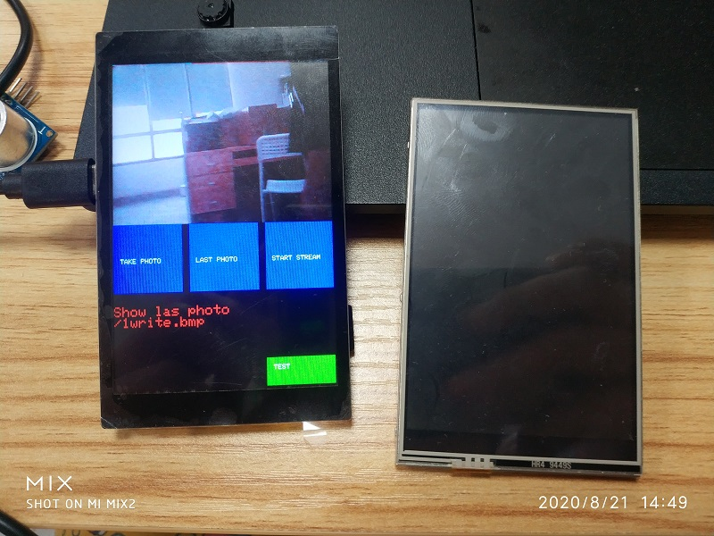


[toc]

# OVERVIEW

## Introduce

[Makerfabs home page](https://www.makerfabs.com/)

[Makerfabs Wiki](https://makerfabs.com/wiki/index.php?title=Main_Page)

The realization of a simple digital camera, you can take pictures through the camera framing. It is displayed on the TFT screen and provides touch options. Photos taken can be saved on an SD card.

## Equipment list

- ESP32 Touch Camera
- Micro SD card

## Related projects

[ESP32 2048 GAME](https://github.com/Makerfabs/Project_ESP32-2048GAME)

Implement a 2048 game on "ESP32 Touch Camera". 

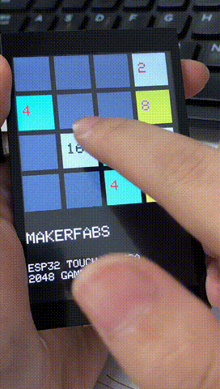

[ESP32 Flappy Bird](https://github.com/Makerfabs/Project_ESP32-Flappy-Bird)

Implement a Flappy Bird game on "ESP32 Touch Camera". 


# ESP32 Touch Camera

## Product link ：[ ESP32 Touch Camera(Resistive)](https://www.makerfabs.com/esp32-3.5-inch-tft-touch-resistive-with-camera.html) 

## Product link ：[ ESP32 Touch Camera(Capacitive)](https://www.makerfabs.com/esp32-3.5-inch-tft-touch-capacitive-with-camera.html) 

The ESP32 Touch Camera use ILI9488 screen, which comes with resistive or capacitive screens. Have an OV2640 camera and SD card slot. It can be used as a webcam, an electronic album, or a digital camera. Support for Arduino and MicroPython. 

## Feature

- Integrated ESP32 2.4G WiFi and Bluetooth.
- Micro SD card slot on board.
- Input 5.0V Type-C USB .
- OV2640 is a 1/4 inch CMOS UXGA (1632*1232) image sensor manufactured by OmniVision.
- LCD 3.5 inch Amorphous-TFT-LCD (Thin Film Transistor Liquid Crystal Display) for mobile-phone or handy electrical equipments.
- NS2009 is A 4-wire resistive touch screen control circuit with I2C interface, which contains A 12-bit resolution A/D converter.

- The FT6X36 Series ICs are single-chip capacitive touch panel controller IC with a built-in 16 bit enhanced Micro-controller unit (MCU).


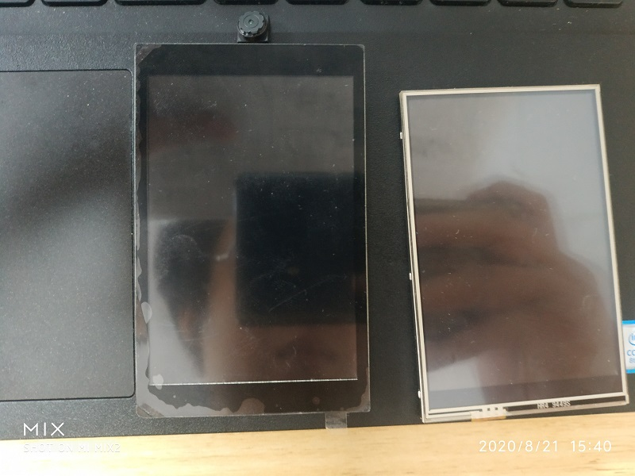

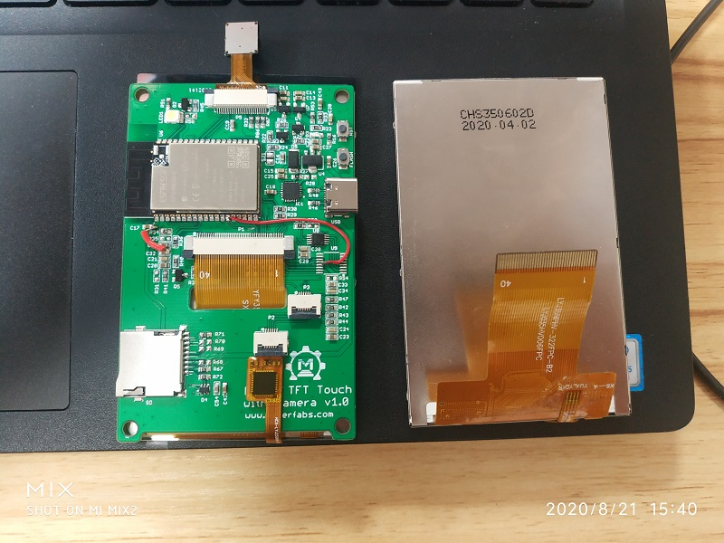


# Project

## Project introduction

Four projects were implemented : "Camera", "Touch_Draw", "SD2TFT" and "Receive WiFi Video".

### Camera_V2

- Take photos with OV2640 camera and preview in real-time on TFT screen.
- You can save photos to an SD card.
- Photos taken can be viewed through the TFT screen.

### Touch_Draw_V2

- Use your hand or stylus (resistance screen) to draw on the screen.

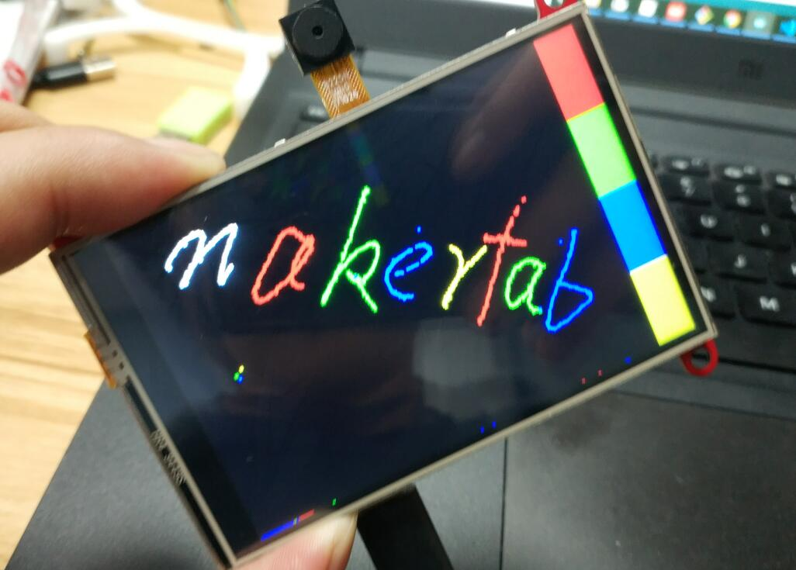

### SD2TFT 

- Display pictures from SD card.
- Loop back the images in the SD card.

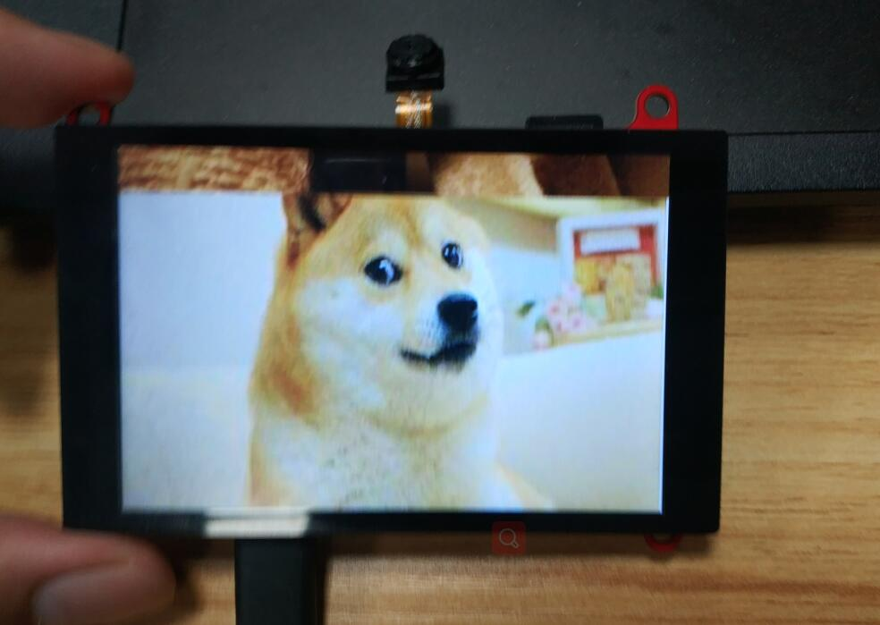

### Receive WiFi Video

Transmit the contents of the monitor to the TFT screen via Wifi.A host computer software is provided to box select the areas of the screen that need to be transferred.

Change from [MakePython ESP32 Color LCD で 動画をWiFi受信](https://homemadegarbage.com/makerfabs05)

- Upload file : "/Project_Touch-Screen-Camra/ESP32_ScreenShotReceiver-master/ScreenShotReceiver/ScreenShotReceiver.ino"
- Open "/Project_Touch-Screen-Camra/ESP32_ScreenShotReceiver-master/ScreenShotSender.exe"
- Input IP on the screen.

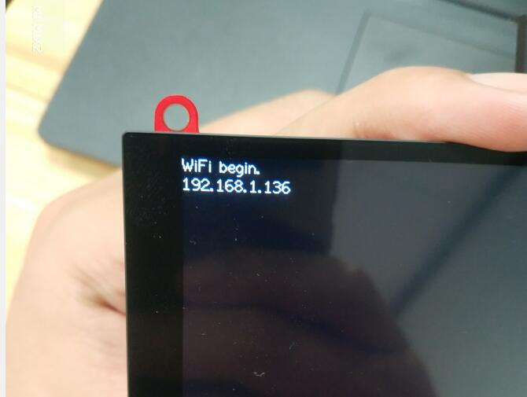

- Push connect.
- Start share your screen to TFT.


## Compiler Options

**If you have any questions，such as how to install the development board, how to download the code, how to install the library. Please refer to :[Makerfabs_FAQ](https://github.com/Makerfabs/Makerfabs_FAQ)**

- Install board : ESP32 .
- Install library : LovyanGFX library. (SD2TFT is use a different GFX lib, depend on Adafruit_GFX. )
- Edit the code based on the touch screen. If you use resistive screen, choice NS2009_TOUCH. If you use capacitive screen, choice FT6236_TOUCH.

```c++
#define NS2009_TOUCH        //Resistive screen driver    
//#define FT6236_TOUCH      //Capacitive screen driver

#ifdef NS2009_TOUCH
#include "NS2009.h"
const int i2c_touch_addr = NS2009_ADDR;
#endif

#ifdef FT6236_TOUCH
#include "FT6236.h"
const int i2c_touch_addr = TOUCH_I2C_ADD;
#endif

```

- Upload codes, select "ESP32 Wrover Module" and "Huge APP"

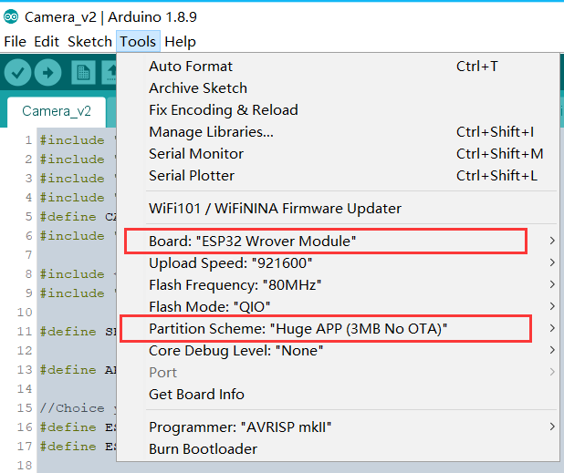

- Insert a Micro SD card into ESP32 Touch Camera.

## How To Use ESP32 Touch Camera

- Open the serial port monitor after uploading the code.
- Serial port will return initialization information, pay attention to see if there is any error.

```txt
14:48:49.096 -> ets Jun  8 2016 00:22:57
14:48:49.096 -> 
14:48:49.096 -> rst:0x1 (POWERON_RESET),boot:0x17 (SPI_FAST_FLASH_BOOT)
14:48:49.096 -> configsip: 0, SPIWP:0xee
14:48:49.096 -> clk_drv:0x00,q_drv:0x00,d_drv:0x00,cs0_drv:0x00,hd_drv:0x00,wp_drv:0x00
14:48:49.096 -> mode:DIO, clock div:1
14:48:49.096 -> load:0x3fff0018,len:4
14:48:49.096 -> load:0x3fff001c,len:1100
14:48:49.096 -> load:0x40078000,len:9232
14:48:49.096 -> load:0x40080400,len:6400
14:48:49.096 -> entry 0x400806a8
14:48:50.641 -> ILI9488 Test!
14:48:50.641 -> I2C device found at address 0x38  !
14:48:50.675 -> Card Mount Successed
14:48:50.675 -> SD init over.
14:48:51.397 -> TFT init over.
14:49:10.660 -> Image name：/0write.bmp
14:49:13.859 -> Image name：/1write.bmp

```


- If the SD card cannot be mounted on return, you need to re-insert the SD card.
- If everything is normal, the camera interface will be displayed.


- Press the camera button to take photos automatically.
- Click on the previous photo to show the last photo saved on the SD card.

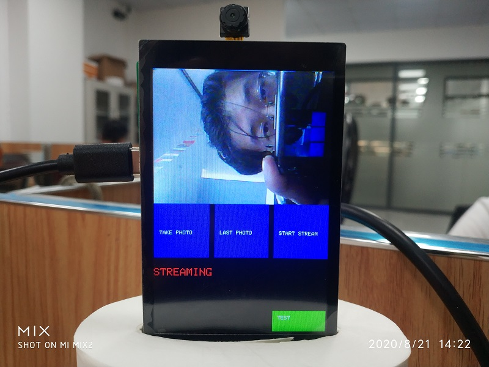

- Pressing to show the last photo will stop the camera acquisition. To restore the preview, press open Stream.
- Restore stream mode to take photos again.
- You can unplug your SD card and plug it into your computer to view your photos.

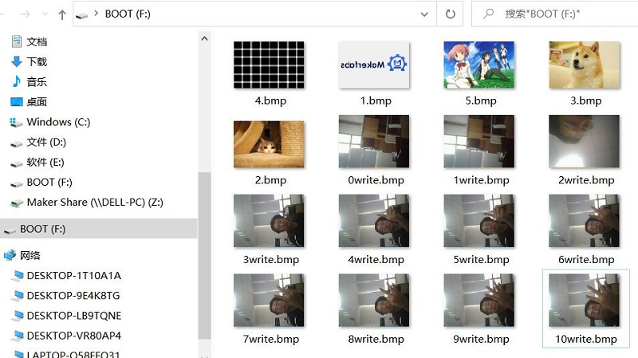

## V3.2 Upload photos via WiFi
Added the function of sending photos to PC via HTTP protocol by post method.
- Remove comments before WIFI_MODE

```c++
#define WIFI_MODE
```
- Set the wifi ssid and password.

```c++
// wait for WiFi connection
WiFi.mode(WIFI_STA);
WiFi.begin("Makerfabs", "20160704");
```
- Upload code to ESP32 camera.
- Run the server.py  on PC side.(Make sure to run in the directory server.py, otherwise the upload path cannot be found.)

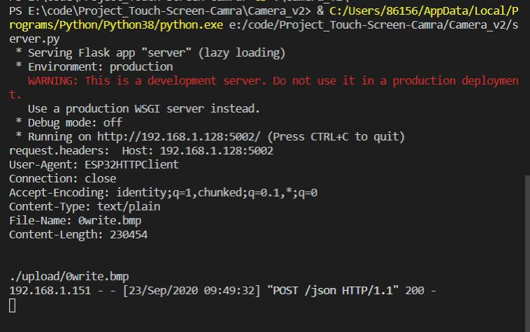
- Every time you click to show the last photo, it will be automatically uploaded.

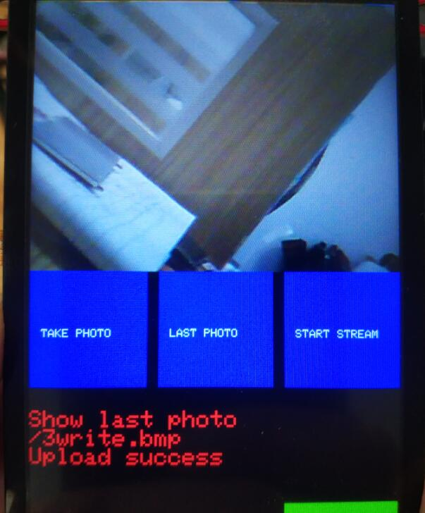
- In a few seconds, the picture will be uploaded to the Upload folder.
- V3.3  :  The UI has changed, but the functionality remains the same.

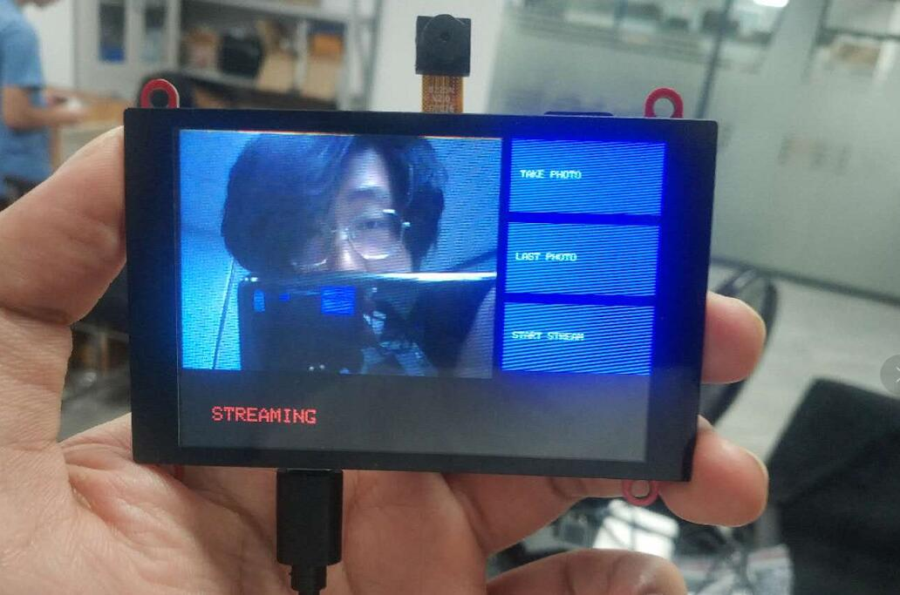


## V4.0 Show Example

Add 4 example in /Project_Touch-Screen-Camra/example

- Aht10 show
- HCSR04 meter
- Web button
- Wind speed show

These examples depend on TFT_eSPI library. You must set "User_Setup.h".
Set screen type.

```c++
// Only define one driver, the other ones must be commented out
//#define ILI9341_DRIVER
//#define ST7735_DRIVER      // Define additional parameters below for this display
//#define ILI9163_DRIVER     // Define additional parameters below for this display
//#define S6D02A1_DRIVER
//#define RPI_ILI9486_DRIVER // 20MHz maximum SPI
//#define HX8357D_DRIVER
//#define ILI9481_DRIVER
//#define ILI9486_DRIVER
#define ILI9488_DRIVER     // WARNING: Do not connect ILI9488 display SDO to MISO if other devices share the SPI bus (TFT SDO does NOT tristate when CS is high)
//#define ST7789_DRIVER      // Full configuration option, define additional parameters below for this display
//#define ST7789_2_DRIVER    // Minimal configuration option, define additional parameters below for this display
```
And set pins.

```c++
// For 3.5" 9488
// The hardware SPI can be mapped to any pins

#define TFT_MISO 12
#define TFT_MOSI 13
#define TFT_SCLK 14
#define TFT_CS   15  // Chip select control pin
#define TFT_DC    33  // Data Command control pin
#define TFT_RST   26  // Reset pin (could connect to RST pin)
    

```

## V4.1 Show Example

Add environment monitoring module demo.

- Line chart

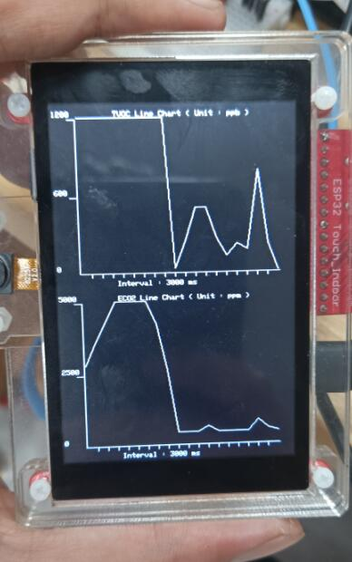

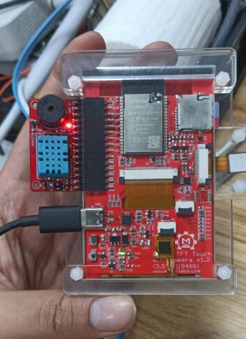

## FAQ

### Q: Can't Upload!

A: Switch to a good USB cable. Poor USB cable quality can cause ESP32 to reboot or fail to upload. Open the serial monitor, observe serial port information.

### Q: The screen is white!

A: The SD card was not mounted successfully, so the program goes into an endless loop. Re-insert the SD card and restart it. Open the serial monitor,  The serial port will display the work log.

### Q: It doesn't show the picture that was just taken!

A: It may be that after shooting, the SD card was not in good contact, so it could not be stored in the SD card. Playback photos are read inside the SD card photos. Re-insert the SD card and restart it.

### Q: Other questions...

A: Re-insert the SD card and restart it. Can solve most problems. (laugh)